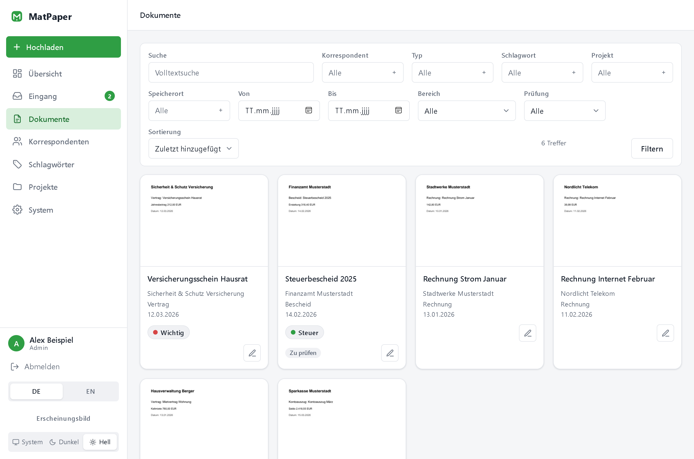
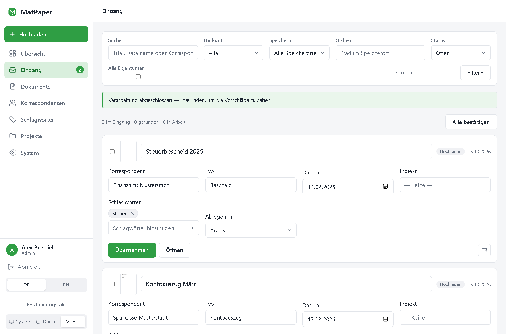
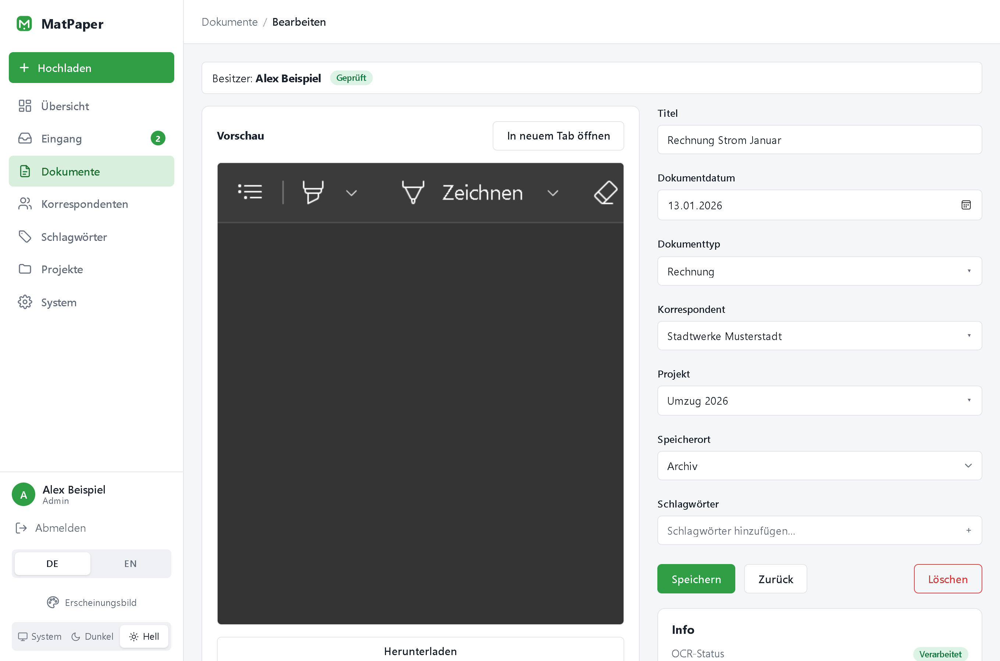
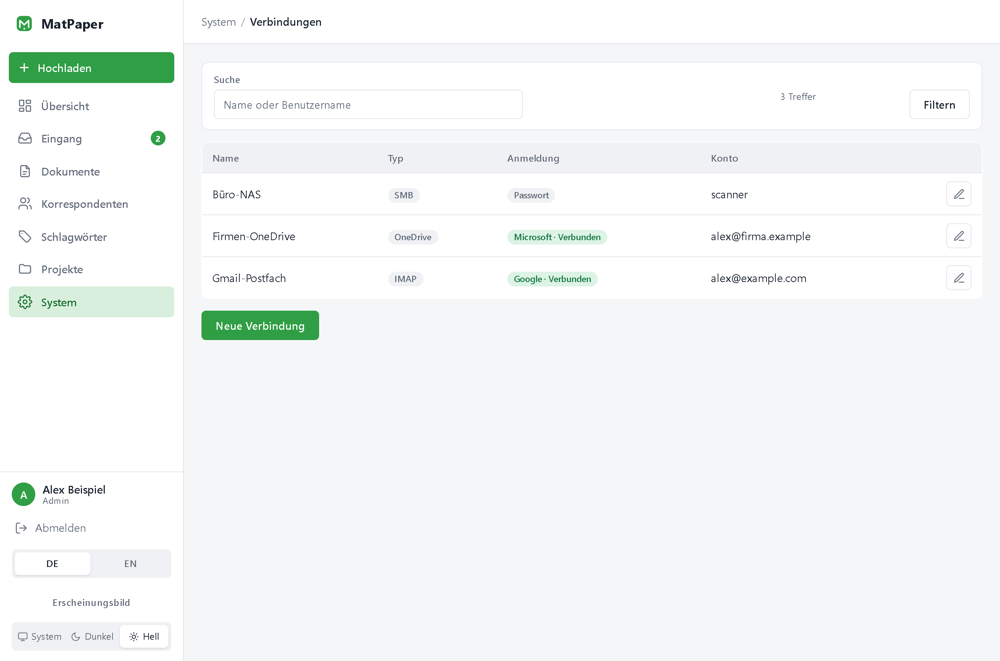
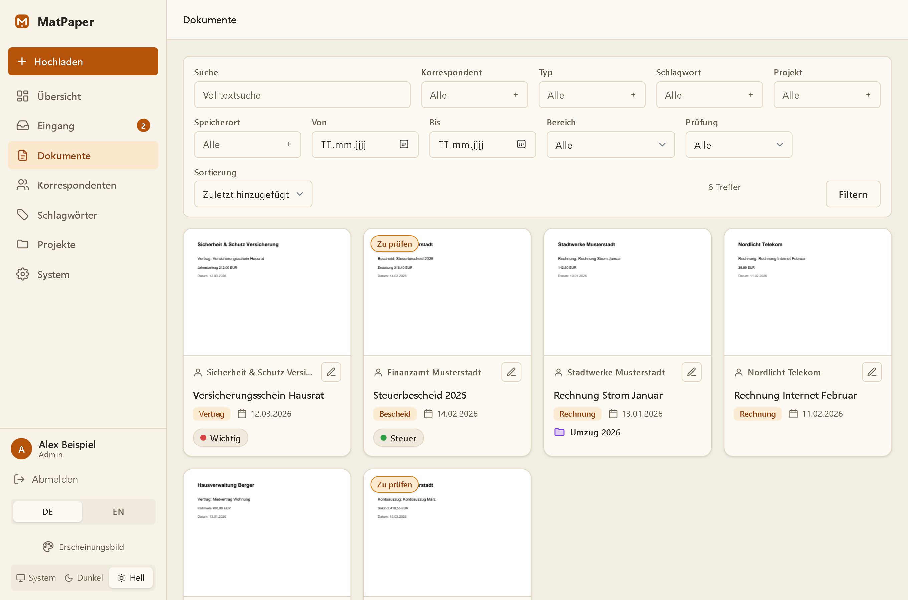
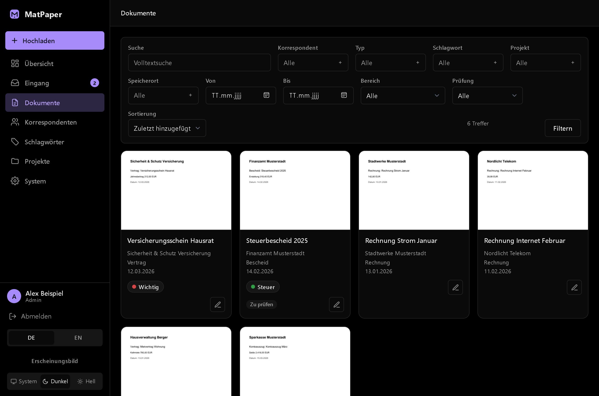
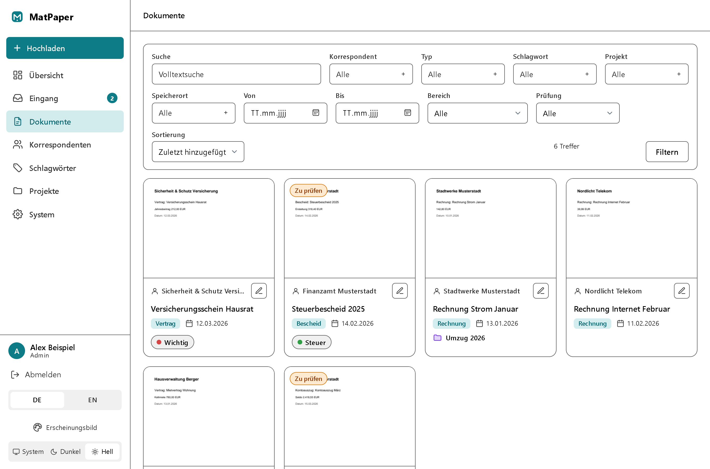
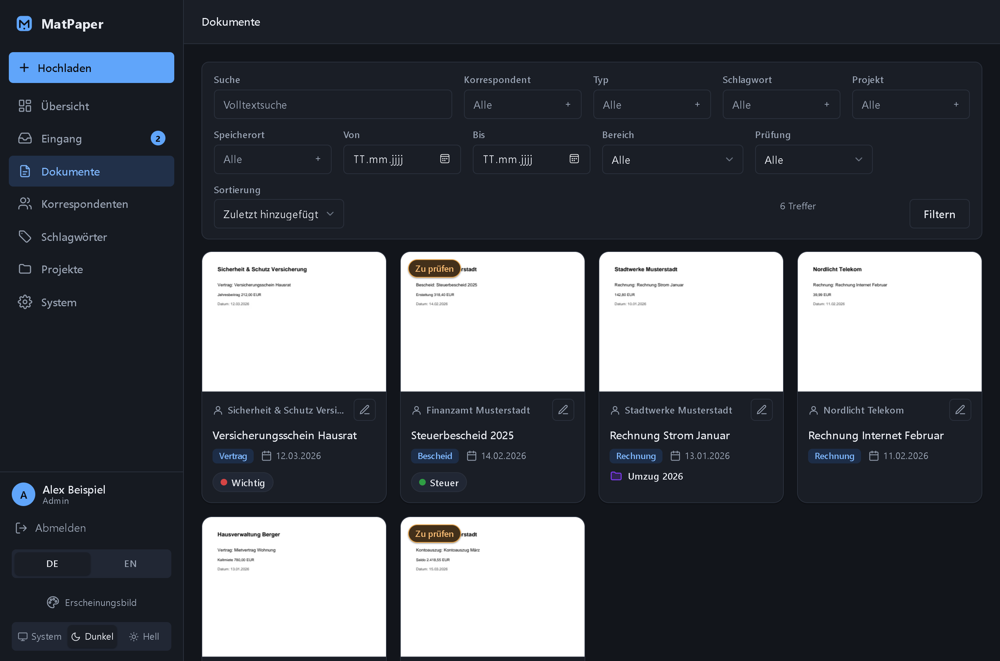
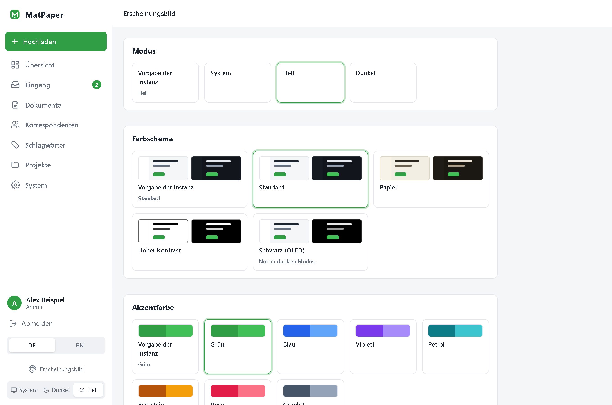
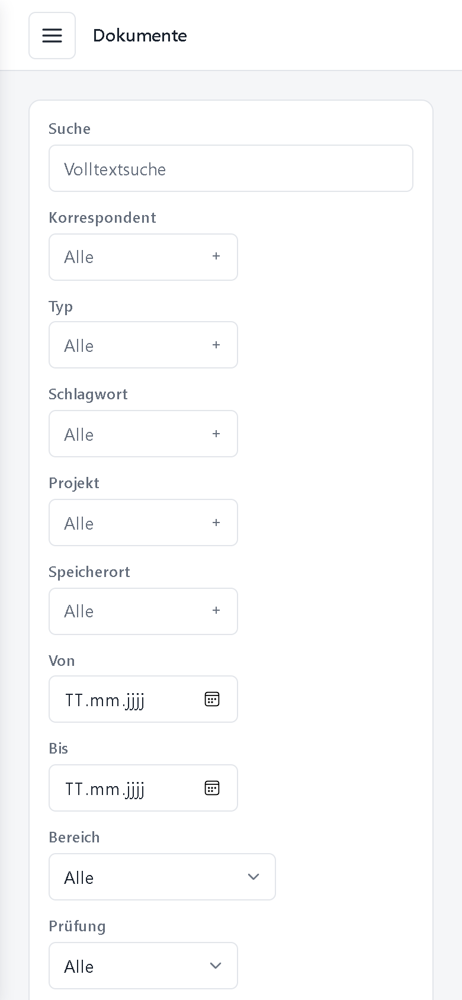

# MatPaper

MatPaper is a self-hosted, Dockerized document management system (DMS) — a lightweight
alternative to [Paperless-NGX](https://github.com/paperless-ngx/paperless-ngx) built on a
modern .NET stack.

## Screenshots

Taken from a demo instance with made-up documents (German UI; English is built in).

| | |
|---|---|
|  |  |
| **Documents** — thumbnails, full-text search and filters | **Inbox** — everything not yet filed, taken over with one click |
|  |  |
| **Detail** — preview, metadata, sharing | **Connections** — NAS, mailboxes and cloud drives, defined once |

**Themes.** Light, dark or system, five colour schemes and seven accent colours — every
combination is checked for readable contrast. Each user picks their own look (it follows the
account to every device); the administrator sets the default for everyone else and for the
sign-in page.

| | |
|---|---|
|  |  |
| **Paper** with amber | **Black (OLED)** with violet |
|  |  |
| **High contrast** with petrol | **Dark** with blue |

<p>
  
  
</p>

## Tech stack

- **.NET 10** (ASP.NET Core **Razor Pages**)
- **PostgreSQL** (via Npgsql / EF Core 10) with full-text search (`tsvector` + `pg_trgm`)
- Runs entirely in **Docker**

## Features (evolving)

- Document storage with correspondents, tags, projects and document types
- One inbox: everything that is not in the archive yet waits there — uploads, mail and
  folder imports, and files a storage search found — and is taken over with one click
- Storage locations on local folders, **SMB/CIFS shares**, **Google Drive** or **OneDrive** —
  no host mount needed; every location has a folder picker
- **Connections** (System → Connections): a NAS, a mailbox or a cloud drive is defined once
  — with a password / app password or **OAuth** (Gmail, Office 365, Google Drive, OneDrive) —
  and reused by storage locations and import tasks
- Full-text search over title and OCR text
- Import (IMAP / POP3 / filesystem / SMB) and export/backup tasks
- Themes per user, instance settings page (public address, time zone, default language),
  German and English UI
- Per-user ownership, sharing and a common area; cookie-based authentication with roles

See [PLAN.md](PLAN.md) for the full roadmap and phase breakdown.

## Running (development)

```bash
docker compose -f docker-compose.dev.yml up -d --build
```

Then open:

- **App:** http://localhost:4994
- **pgAdmin:** http://localhost:4995 (login `admin@matpaper.example.com` / `matpaper`)

## Running (release)

The release compose file pulls the prebuilt image from GHCR and omits pgAdmin:

```bash
docker compose -f docker-compose.release.yml up -d
```

## Data

Application data (config, data-protection keys, thumbnails) is persisted in the `/data`
volume.

**Inbox.** The inbox lists every document that has not been taken into the archive yet,
no matter where it came from. Two kinds of entry share the list:

- *Staged* — uploaded, camera-scanned or imported. The file waits in a local staging
  folder (`/data/inbox` by default) and is moved into a storage location when you take the
  document over. To keep that folder off the container host (e.g. on a NAS), mount a share
  into the container and point `MATPAPER_INBOX` (or `Storage.InboxPath` in
  `/data/config/app.json`) at it; see the commented `matpaper-inbox` example in the compose
  files. It must be a local path inside the container because OCR and thumbnail generation
  run directly on it.
- *Found* — discovered by a storage search. The file already lies inside a storage
  location and nothing is copied. Taking it over either adopts it where it is or re-files
  it by the location's path template. Files you do not want are ignored, not deleted: the
  entry keeps the next search from offering them again.

Nothing is read from disk during a search, so pointing MatPaper at a large archive is
cheap. Text recognition for found files starts when you take one over or press "analyze".

A storage location can run its search on a schedule, like the import and export tasks. Every
run, manual or scheduled, is recorded in the task history with its log.

Documents in the common area appear in everybody's inbox and everybody may take them over or
ignore them. Deleting stays with the owner. A deleted document goes to the bin, reachable
through the "Deleted" filter on the document list, and can be restored as long as its file
still exists.

**Storage locations** (System → Storage locations) hold the filed documents. A location is
a local folder (such as the `/storage` volume or a mounted share), an SMB/CIFS share reached
over the network, or a Google Drive / OneDrive folder — the last two through a saved
[connection](#connections-and-oauth). Files are placed by the location's
path template, e.g. `{Correspondent}/{Year}/{DocumentType}/{Date} {Title}{Ext}`. Import
tasks that skip the inbox file directly into their configured location. The search icon on
a location looks through it for files MatPaper does not know yet; which extensions it picks
up, who owns the finds, whether they go to the common area and how often the search runs is
configured per location.

**What an import remembers.** An import task does not read everything again on every run.
IMAP tasks store the folder's position (UIDVALIDITY and the highest UID handled) and ask the
server only for newer messages; POP3 tasks remember the UIDLs they handled; folder and SMB tasks
remember path, size and modification time of the files they handled. If the server renumbers a
folder, or the task's folder, filters or period change, the task starts over. "Start over" on
the task does the same by hand. The content hash stays the safety net: a file that already
exists is never filed twice.

Under *Period* a task can be limited to the last N days or to items from a given date on — for
IMAP the server does that filtering, so an old mailbox is not fetched at all. The preview in
the wizard looks at the newest 200 to 5000 items (POP3: at most 500, as it has to download
each message) and shows 25 at a time; it ignores the remembered position so it always shows
what the filters would catch.

## Connections and OAuth

**Connections** (System → Connections) hold *where* something is and *how to sign in*:
SMB shares, IMAP/POP3 mailboxes, Google Drive and OneDrive. Storage locations and import tasks
pick a saved connection instead of carrying their own host and password. Secrets are encrypted
with ASP.NET Data Protection (keys in `/data/keys`) and never shown again.

Gmail, Office 365, Google Drive and OneDrive sign in with **OAuth**. There is no shared
MatPaper app — you register your own with Google Cloud or Azure, enter its client ID and
secret in the connection and press *Connect*:

1. Set the **public address** of your instance under System → Settings (or with
   `MATPAPER_PUBLIC_URL`). The page then shows the **redirect URI**
   (`<address>/System/Connections/OAuthCallback`); register exactly that with Google/Azure.
2. Google: publish the Cloud project as *In production*, otherwise the authorization expires
   after seven days. Scopes: `https://mail.google.com/` (mail) or `…/auth/drive` (Drive).
3. Microsoft: delegated `Files.ReadWrite.All` (OneDrive) or the IMAP/POP scopes (mail),
   plus `offline_access`.

Where an app password is simpler (e.g. Gmail with 2-factor), choose the password sign-in.

## Settings

System → Settings edits the public address, the time zone (used for every displayed time and
for task schedules) and the default language/theme, and shows version, data folder and
database. Changes are written to `/data/config/app.json` and apply immediately. A value pinned
by an environment variable (`MATPAPER_PUBLIC_URL`, `MATPAPER_TZ`) is shown locked.
Database, data folder and inbox folder are read at startup.
